# Nyan Keys Hardware Docs v0.8a
Hardware documentation for the Nyan keys keyboard. MIT licenced so feel free to build and modify these designs.

# Schematics
Schematics are provided as a .pdf file and will up to date with the latest release of nyan keys hardware.

# Where is the .brd file?
There currently is a deliberate choice to not release a .brd file with this as I don't intend to allow Nyan Keys board to be produced
commmercially. As such I want to make sure the proper licenses are in place to do that. email admin@qrsnap.io if you are interested in
obtaining board files for personal use.

At the end of the day, I want to sell the boards that designed and don't want other comercial entities with a low barrier to entry
do the same.

# Layout

 

 

# Fabrication

 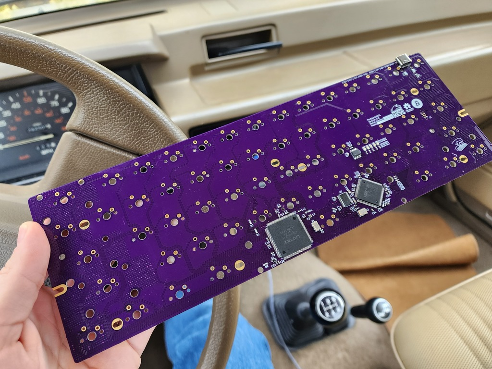
 

 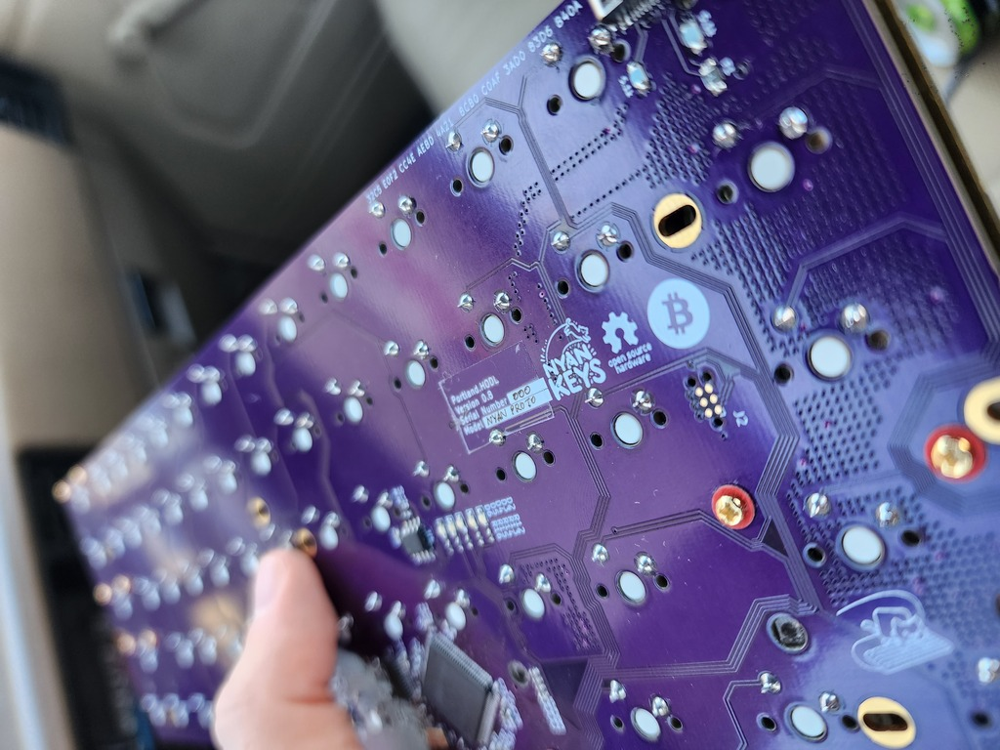
 

 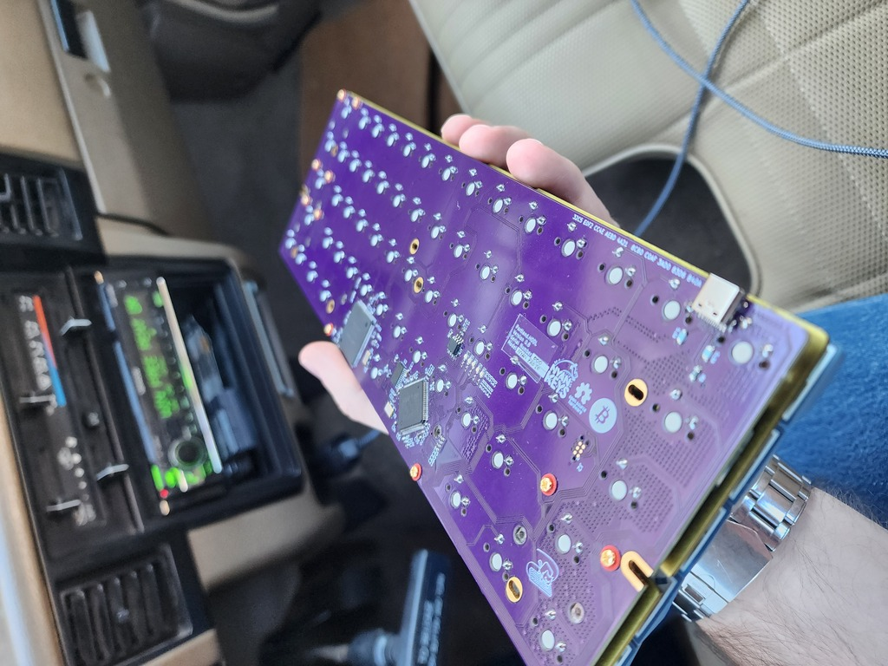
 

 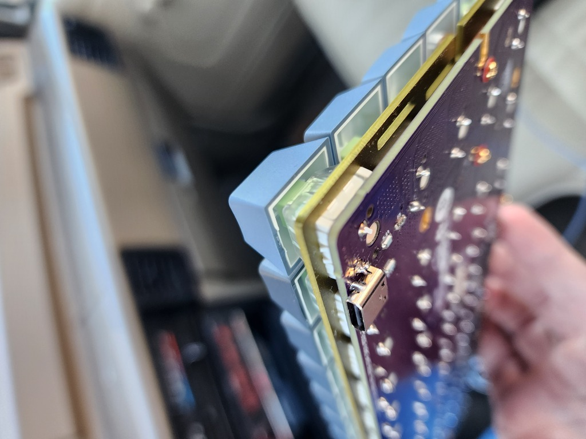
 

 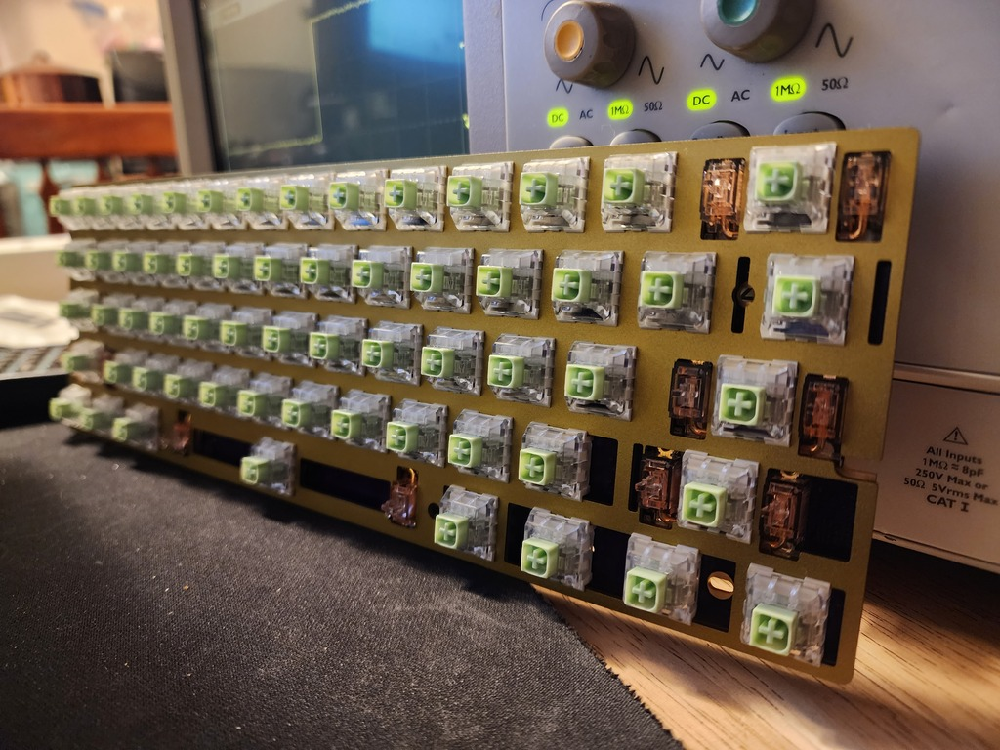
 

 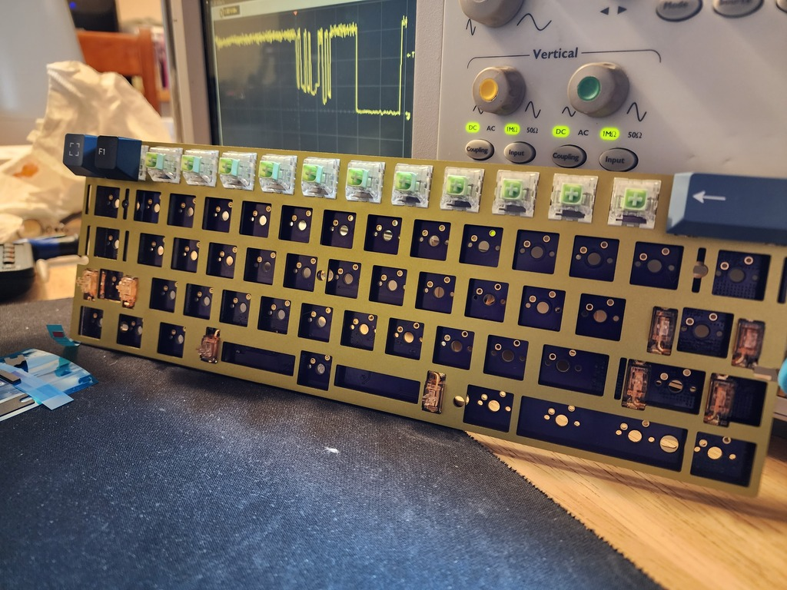
 

 
 

 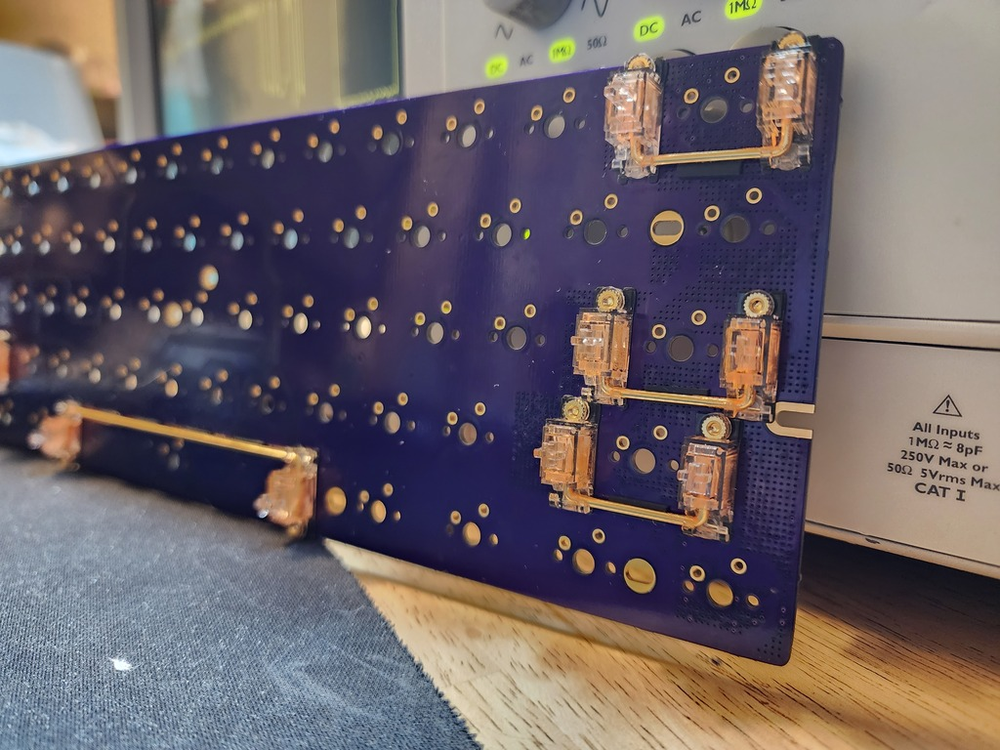
 

 

# Assembled

 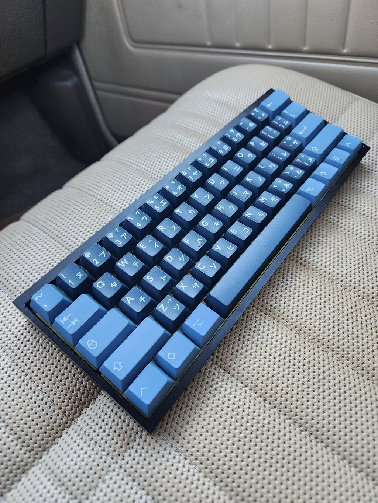
 

 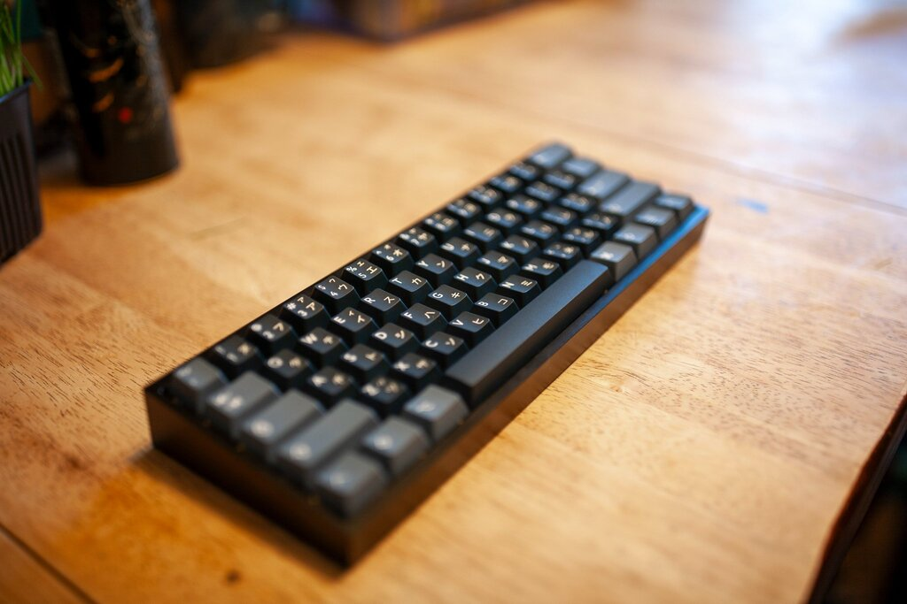
  

 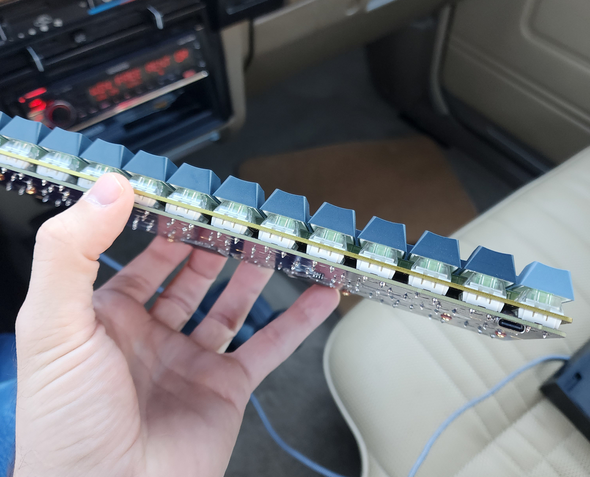
  

 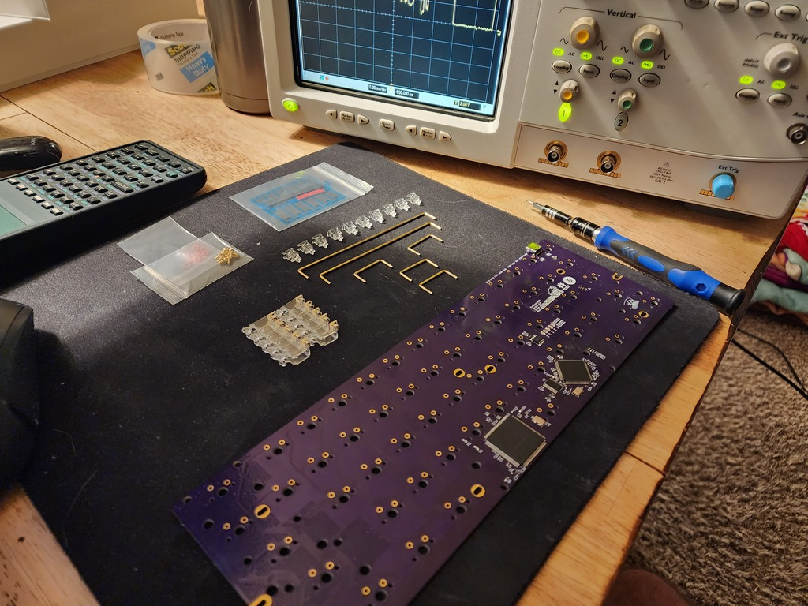

 

# Other

 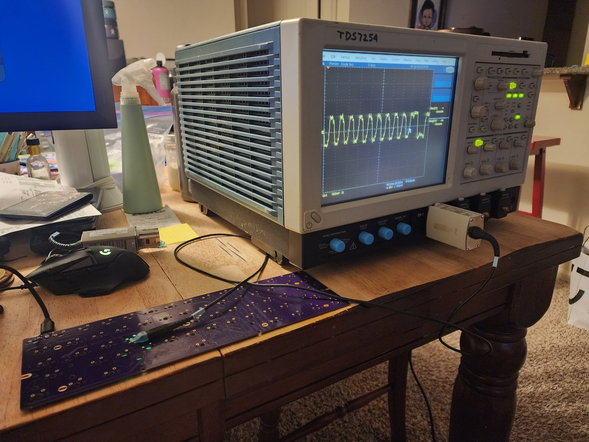
 

 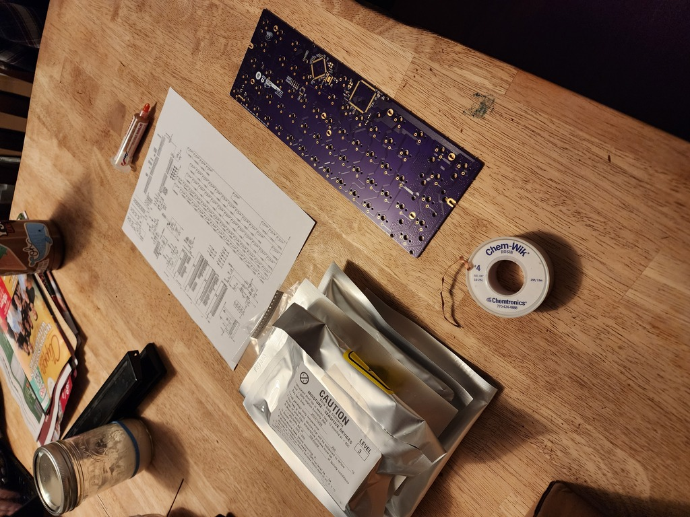
 

 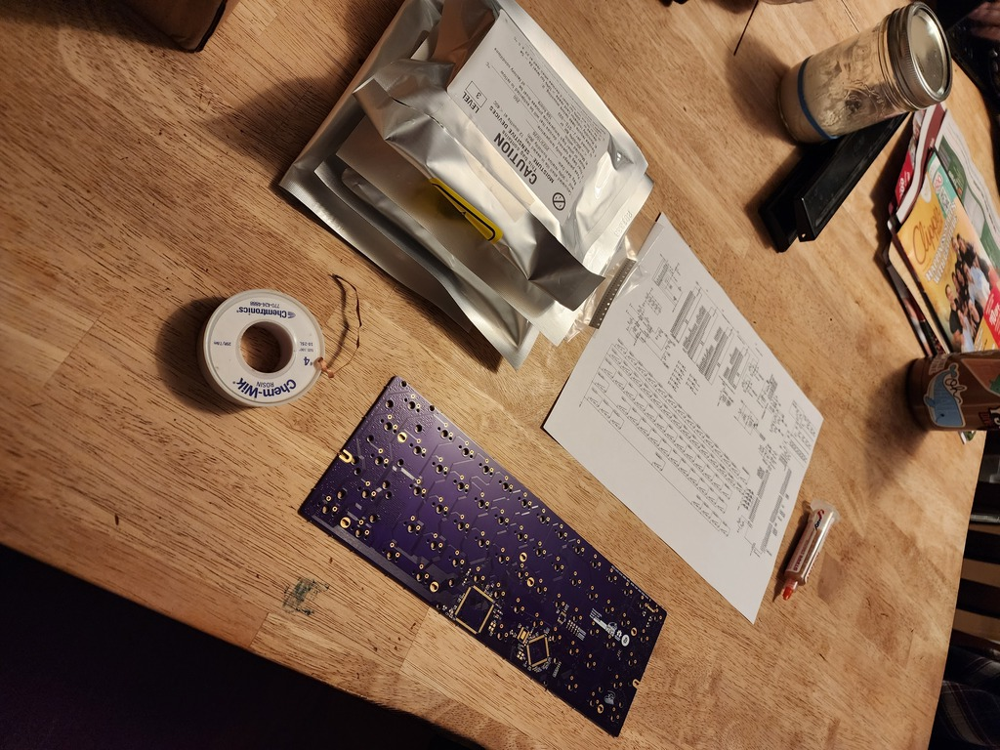

